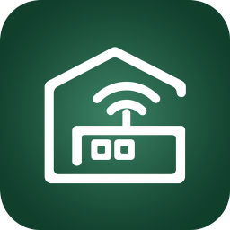
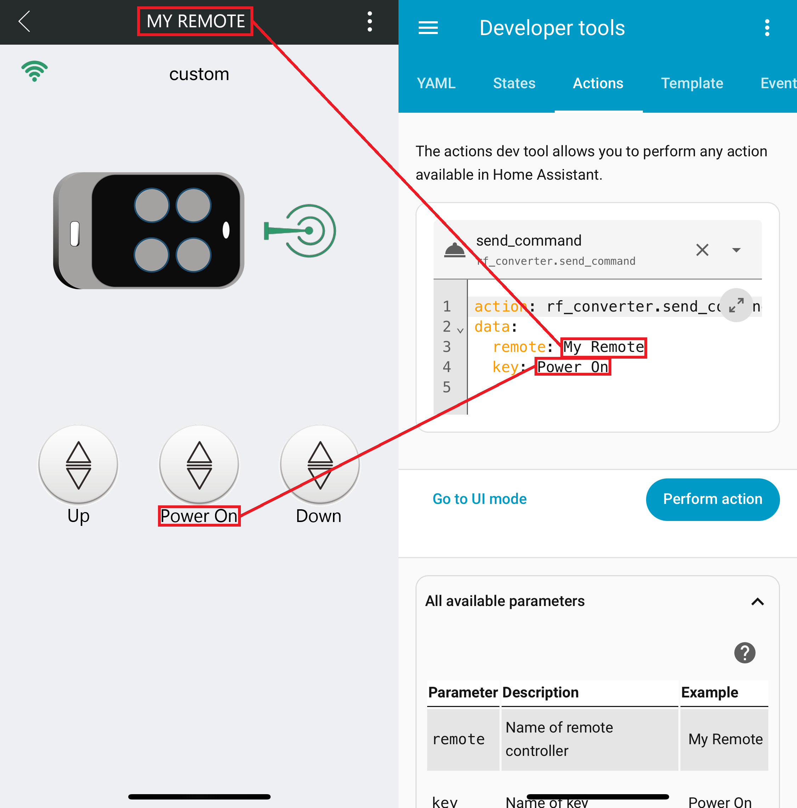

# RF Converter Assistant Custom Component

The `RF Converter Assistant` is a custom component for Home Assistant that enables direct communication with the **RF Converter V3.0** to control devices using RF signals.

[Product Homepage](https://www.yetremotecontrol.com/products-detail-165885)

## Installation
0.  **Prerequisite**: Download the `Safemate` app (the vendor's official app) on your mobile device and sign up. Add your remote controller and keys as instructed by the vendor.

### 1\. Installation via HACS (Recommended)

1.  **Add Custom Repository**: In Home Assistant, go to **HACS** \> **Integrations**. Click the three-dot menu in the top right and select **Custom repositories**.
2.  **Enter Repository Details**: In the pop-up, enter `https://github.com/3735943886/rf_converter` as the **Repository URL**. For the **Category**, select **Integration**. Then, click **Add**.
3.  **Install the Integration**: Search for "**RF Converter Assistant**" in the HACS Integrations section. Click on it and then click the **Download** button.
4.  **Restart Home Assistant**: Restart your Home Assistant instance to complete the installation.

### 2\. Manual Installation

1.  **Download**: Clone the Git master branch or download it as a ZIP file.
2.  **Copy Files**: Copy the `rf_converter` directory to Home Assistant's `custom_components` directory.
3.  **Restart Home Assistant**: Restart your Home Assistant instance to complete the installation.

## Component Configuration

1.  Add the `RF Converter Assistant` integration in Home Assistant.
2.  When prompted, enter your username from the `Safemate` app.

## Usage

Once installed, the following actions will be available. No devices nor entities are created by this integration.

  - **RF Converter Assistant: reload\_remote**: This action obtains your remote controller data from the vendor's cloud server and saves it locally. It's automatically called during the first run. Use this manually to update your local data if you make any changes to your remotes in the `Safemate` app.

  - **RF Converter Assistant: send\_command**: This action sends an RF signal from the RF Converter V3.0 to a target device. You must provide the `remote` and `key` parameters, which must exactly match the names you used in the `Safemate` app.

### Example YAML

To call the `Power On` key of a remote named `My Remote`, use the following YAML code:

```yaml
action: rf_converter.send_command
data:
  remote: My Remote
  key: Power On
```


